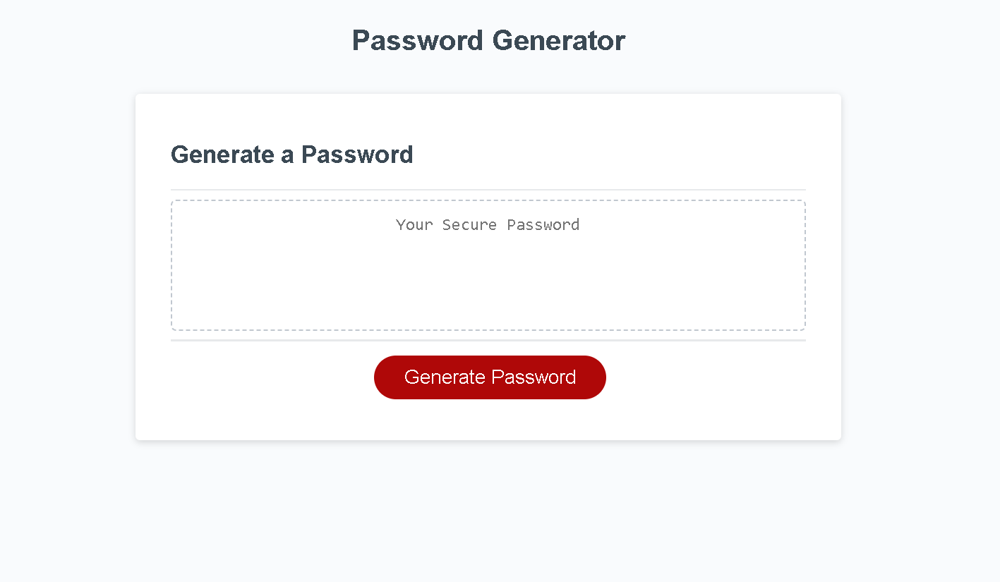

# Password Generator Starter Code

## Description

In this project I created a random password generator using javaScript.  This website lets the user generate a random password of a submitted length by the user. The user may also select what types of characters may be in the password such as: lowercase characters, uppercase characters, numeric values, and special characters.

## Usage

This website is hosted at this link: https://smudge121.github.io/Password-Generator/  

To view the source code, download the code from the repository.  The javascript is contained in the develop folder along with the css for the application.

## Credits

1. JavaScript written by - Jaret Ishii
2. HTML and CSS provided by UCI bootcamp

## License

MIT License
